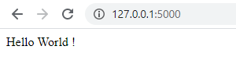
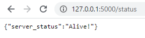
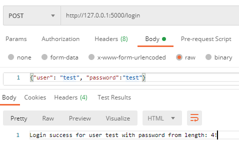
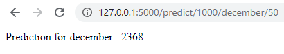

# challenge-flask-api

[link to the descriptive challenge](https://github.com/leersmathieu/CRL-Turing-4.22/blob/master/Content/02-Deployement/1.Flask/3.Challenge.ipynb)

## The Mission

You are intern in a company to provide AI models to their customer. Unfortunatly the machine learning engineers that work with you are not very goods... They spend more time drinking coffee and play video games than doing their job. After few weeks their the project manager come to you and tell you that they have a client that is really upset to not have his model yet. He ask you to already create the API to get the data and return a random prediction. It will give him more time to beg the ML to finish the project.

## Resolving

First thing, the **home** page return the content (here is "hello world")

the first request is to create a **route to check the status of the server**

Then I'm going to create a **"login" route** and if the method is "POST" I'll send back the requested information.

Finally, let's define the **"Fake prediction" route**

If you want more information about the technical resolution take a look at the [Notebook](https://github.com/leersmathieu/challenge-flask-api/blob/master/main.ipynb)